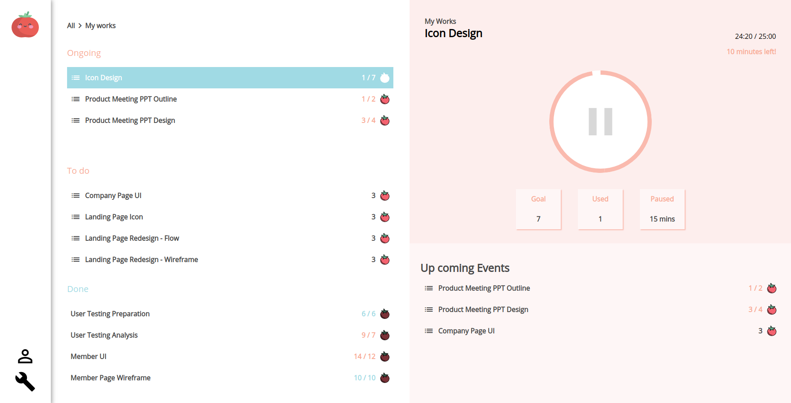

# 前端精神時光屋 - 第一關 - 番茄鐘

設計稿: [shin](https://challenge.thef2e.com/user/2449?schedule=2854#works-2854)



## 執行

```
$ npm install
$ ng serve
```

## Note

-   Angular Flex Layout
-   `@Input`, `@Output`
